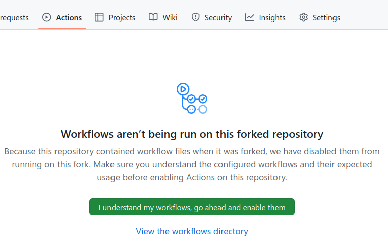

# Contributing updates to Building Blocks

One way to contribute to an already existing Building Blocks register is to
[fork it on GitHub](https://docs.github.com/en/pull-requests/collaborating-with-pull-requests/working-with-forks/fork-a-repo),
apply your own changes to your copy of the register and, when ready, create a
[Pull Request (PR)](https://docs.github.com/en/pull-requests/collaborating-with-pull-requests/proposing-changes-to-your-work-with-pull-requests/about-pull-requests)
so that they can be included in the upstream register.

Creating a fork allows you to work on the `master`/`main` branch, which triggers the Building Blocks [postprocessing
workflows](../create/postprocessing), so you can preview your version of the register on its own GitHub pages. However,
by default GitHub disables workflows on forked repositories, so you need to manually enable them on the "Actions" tab
of your forked repository.

## Merge conflicts

The main downside of working with forks is that the Building Blocks postprocessing workflow generates artifacts
inside the `build/` directory of the repository, which can result in 
[merge conflicts](https://docs.github.com/en/pull-requests/collaborating-with-pull-requests/addressing-merge-conflicts/resolving-a-merge-conflict-on-github)
when the Pull Request is created, making the process more difficult.

To work around this, the following bash script can be used to create a "clean" branch excluding all changes in the 
`build/` directory, which can then be used to create the Pull Request from (instead of the `master`/`main` one):
[create-clean-pr.sh](https://gist.githubusercontent.com/avillar/acb3e22d36ddf1ddbf8ff5c1aa64616f/raw/a0046485a48bc1ced94b8d2c6605d32df0f3c3eb/create-clean-pr.sh)

The script is run locally on the directory of the forked register, and it requires that the upstream repository
(i.e., the original Building Blocks register) is
[added as a remote](https://docs.github.com/en/get-started/git-basics/about-remote-repositories#creating-remote-repositories).
By default, the `fork-parent` remote name will be used, but it can be configured to something different (e.g., `upstream`).

The script will create a new branch with a random name, clean any changes done to the `build/` directory and anything in it, 
push the branch to your fork of the register, and provide you with a URL to create the Pull Request directly.

It relies on the [`git-filter-repo`](https://github.com/newren/git-filter-repo) Python script, so you must have a working
Python environment for it to work. If `git-filter-repo` is already installed on your system, the script will use it,
and otherwise will download a copy to a temporary directory (which will be deleted once it is done).