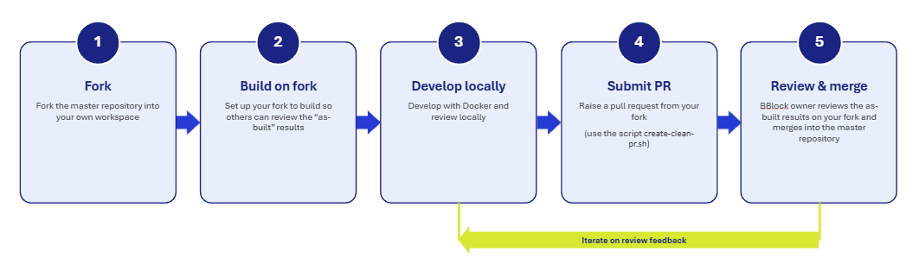
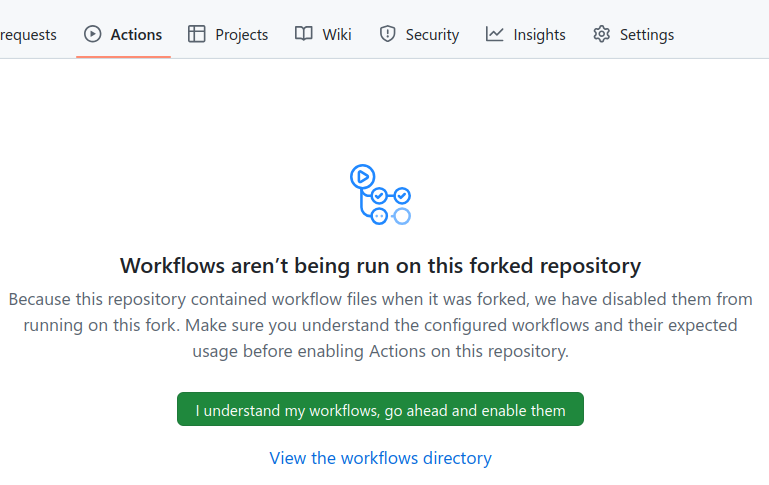

# Contributing updates to Building Blocks

The best way to contribute to an already existing Building Blocks register is to
[fork it on GitHub](https://docs.github.com/en/pull-requests/collaborating-with-pull-requests/working-with-forks/fork-a-repo),
apply your own changes to your copy of the register and, when ready, create a
[Pull Request (PR)](https://docs.github.com/en/pull-requests/collaborating-with-pull-requests/proposing-changes-to-your-work-with-pull-requests/about-pull-requests)
so that they can be included in the upstream register.

## Typical workflow


1. [Fork the repository](https://docs.github.com/en/pull-requests/collaborating-with-pull-requests/working-with-forks/fork-a-repo)
   on GitHub, then enable Actions on it and [configure](https://ogcincubator.github.io/bblocks-docs/build/github) so postprocessing runs on your fork and your "viewer" is enabled on github pages.
2. Clone your fork locally and
   [add the upstream repository as a remote](https://docs.github.com/en/get-started/git-basics/about-remote-repositories#creating-remote-repositories),
   conventionally named `fork-parent` — this is the default name expected by the `create-clean-pr.sh` script
   described under [Merge conflicts](#merge-conflicts) below, though it can be configured to something else.
3. Make your changes and commit/push them to your fork's `master`/`main` branch as usual. Each push triggers the
   Building Blocks [postprocessing workflows](../create/postprocessing), so you can preview your version of the
   register on its own GitHub Pages site (and importantly reviewers can access this content).
4. When ready to submit your changes upstream, run `create-clean-pr.sh` to produce a PR-ready branch free of
   `build/` artifacts, and open the Pull Request using the URL it prints (see [Merge conflicts](#merge-conflicts)).
5. Provide a link to the viewer configured on your fork so that reviewers can see the "as-built" version. 

By default GitHub disables Actions workflows on forked repositories, so before step 3 above will do anything, you
need to manually enable them on the "Actions" tab of your forked repository.



## Avoiding "build" resource merge conflicts

The main downside of working with forks is that the Building Blocks postprocessing workflow generates artifacts
inside the `build/` directory of the repository, which can result in 
[merge conflicts](https://docs.github.com/en/pull-requests/collaborating-with-pull-requests/addressing-merge-conflicts/resolving-a-merge-conflict-on-github)
when the Pull Request is created, making the process more difficult.

To work around this, every register scaffolded from the
[Building Blocks template](https://github.com/opengeospatial/bblocks-template) comes with a `create-clean-pr.sh`
script at its root (alongside `build.sh`/`view.sh`) that creates a "clean" branch excluding all changes in the
`build/` directory, which can then be used to create the Pull Request from (instead of the `master`/`main` one).
If your register predates this script or you've deleted it, you can fetch the current version directly:
[create-clean-pr.sh](https://github.com/opengeospatial/bblocks-template/raw/refs/heads/master/create-clean-pr.sh)
— though note that postprocessing will re-add it automatically on the next run unless it detects it was
deliberately removed from your repo's own git history.

<div class="notice notice--info" markdown="1">
This is a bash script, so on Windows it needs to be run from Git Bash or WSL — see the
[Windows setup notes](../build/local#windows-setup) on the Local Build page.
</div>

The script is run locally on the directory of the forked register, and it requires that the upstream repository
(i.e., the original Building Blocks register) is
[added as a remote](https://docs.github.com/en/get-started/git-basics/about-remote-repositories#creating-remote-repositories).
By default, the `fork-parent` remote name will be used, but it can be configured to something different (e.g., `upstream`).

The script will create a new branch with a random name, clean any changes done to the `build/` directory and anything in it, 
push the branch to your fork of the register, and provide you with a URL to create the Pull Request directly.

It relies on the [`git-filter-repo`](https://github.com/newren/git-filter-repo) Python script, so you must have a working
Python environment for it to work. If `git-filter-repo` is already installed on your system, the script will use it,
and otherwise will download a copy to a temporary directory (which will be deleted once it is done).

Since the script rewrites history, it requires a clean working tree — commit or stash any pending changes on your
`master`/`main` branch before running it.

### Updating an existing Pull Request

Each run of `create-clean-pr.sh` creates a brand new temporary branch (and a new PR URL); it does not update a
previously created one. If you keep committing to your fork's `master`/`main` branch after opening a Pull Request,
re-run the script and either point the existing Pull Request at the newly created branch, or close it and open a
new one from the printed URL. The old temporary branch can then be deleted.

## Fork-specific configuration overrides

When working on a fork, you may want to change some settings in `bblocks-config.yaml` — for example, to use a different
identifier prefix or a different set of imports — without those changes being included in the Pull Request.

You can do this by creating a `bblocks-config-override.yml` (or `.yaml`) file at the root of your repository. Any
top-level key present in this file will override the corresponding value from `bblocks-config.yaml`. For example:

```yaml
# bblocks-config-override.yml
identifier-prefix: my-fork.
imports:
  - https://www.example.com/overriden-import-1
  - https://www.example.com/overriden-import-2
```

The `create-clean-pr.sh` script automatically excludes `bblocks-config-override.yml/yaml` from the clean PR branch,
so these fork-specific settings will never appear in Pull Requests to the upstream register.

<div class="notice notice--warning" markdown="1">
**Pitfall: forks and the SPARQL triplestore.** If the upstream register configures a `sparql` endpoint in
`bblocks-config.yaml` (to publish semantic uplift output to a triplestore), postprocessing on your fork will try to
push to that same endpoint on every run — and fail, since your fork isn't authorized to write to it. This affects
both the postprocessor's own push step and the separate "upload to triplestore" workflow job.

Disable it on your fork by setting `sparql` to `false` or `null` in `bblocks-config-override.yml`:

```yaml
# bblocks-config-override.yml
sparql: false
```

Since this file is excluded from clean PR branches (see above), the upstream `bblocks-config.yaml` — and its real
SPARQL configuration — is left untouched.
</div>