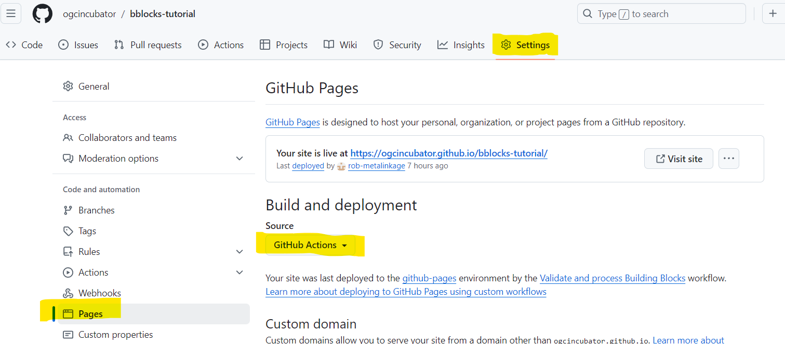
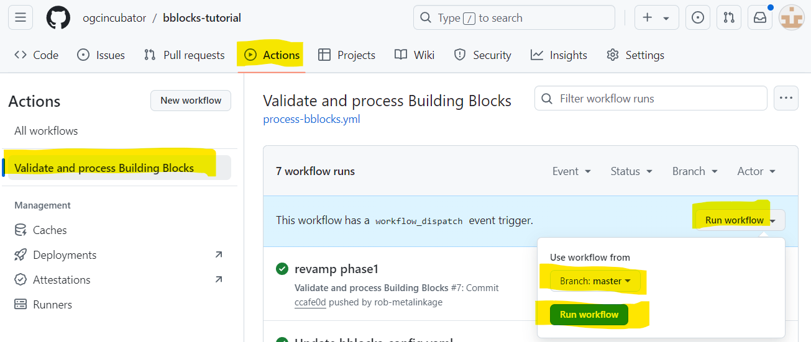
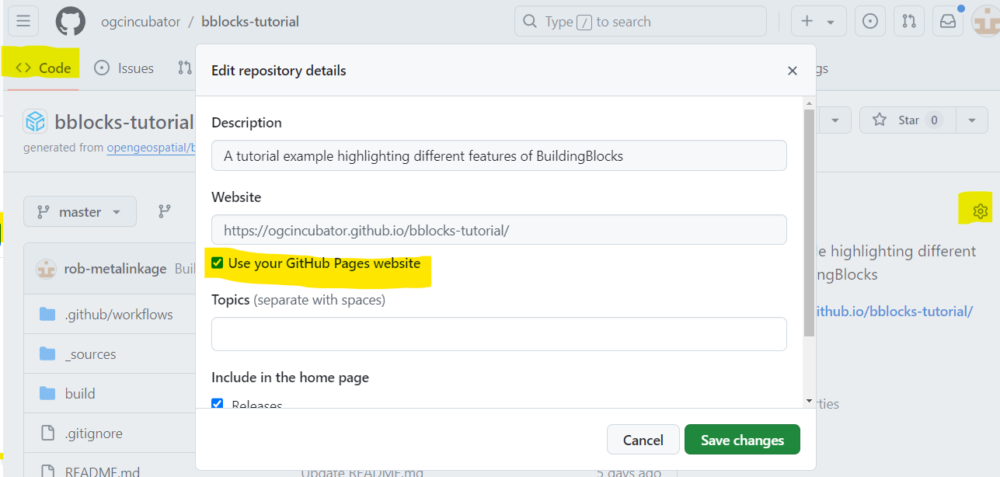
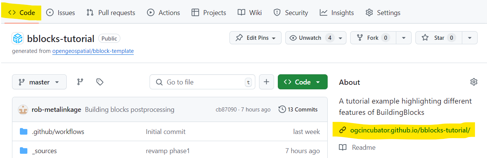
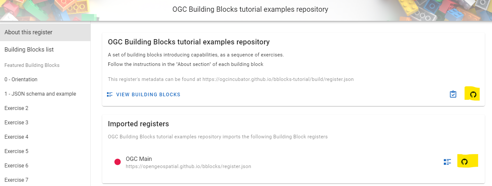

# Configuring Github automations for CI/CT build

New and forked Github repositories need configuration to allow automated building. 

1. Fork the template or another repository to a git organisation you have admin access for.
1. In settings set "pages build" to "Github actions"

2. Run the "validate and postprocess" action 

3. Link the generated output pages to the repo overview by selecting "show" 

You can now navigate between repository sources and the published Building Blocks:

