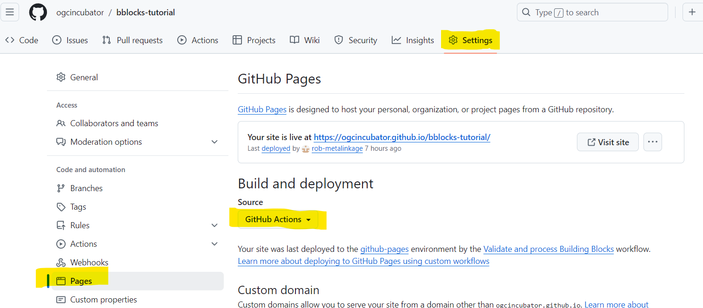
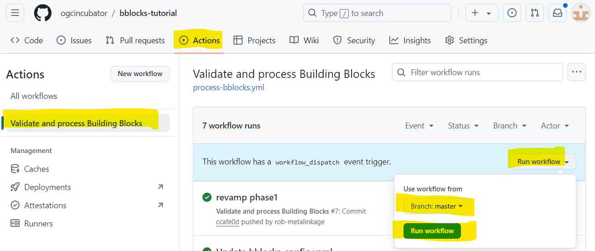
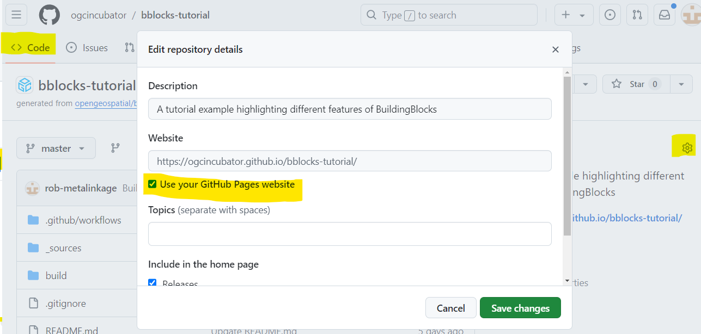
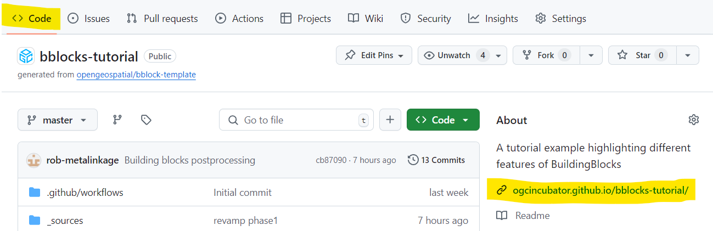
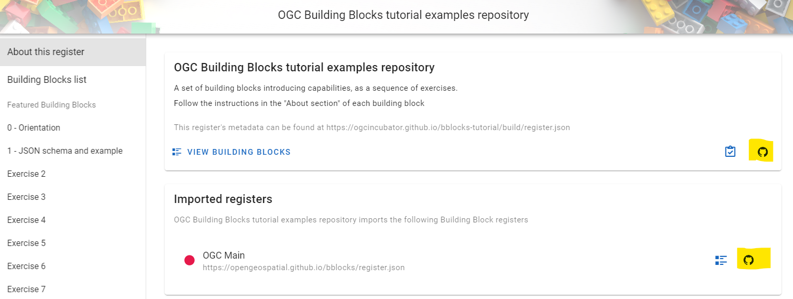

# Configuring Github automations for CI/CD build

New and forked Github repositories need configuration to allow automated building.

1. Fork the template or another repository to a GitHub organization (or personal account) you have admin access to.
   - If you forked an existing repository (rather than starting from the template), GitHub disables Actions
     workflows by default on forks — enable them on the "Actions" tab first, or the next steps won't run. See
     [Contributing updates to Building Blocks](../build/contribution) for details and a screenshot.
2. In settings set "pages build" to "Github actions"

3. Run the "validate and postprocess" action

4. Link the generated output pages to the repo overview by selecting "show"

You can now navigate between repository sources and the published Building Blocks:

