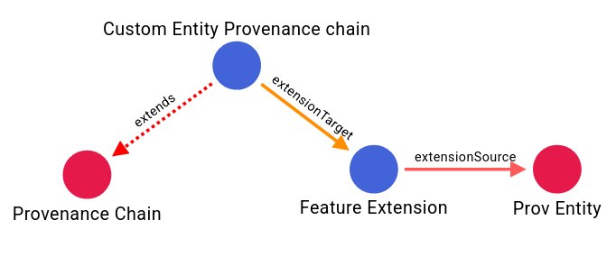

<div class="notice notice--danger" markdown="1">
#### Experimental feature
This feature is highly experimental and may not work correctly in all instances. Proceed at your own risk.
</div>

Extension points allow you to **specialize existing building blocks** by constraining or customizing their 
referenced components. This mechanism enables developers to create tailored versions of standard building 
blocks while maintaining compatibility with the original specifications.

An extension point consists of:
- A **base building block** that you want to extend.
- A set of **mappings** from referenced building blocks in the base (or its imports) to your custom building blocks.

<div class="notice notice--warning" markdown="1">
#### Schema support only
Extensions are currently supported for building blocks with schemas, not for those with OpenAPI documents.
</div>


This approach ensures that any references in the base schema (or recursively in its imports) to a 
given building block are further constrained to conform to your specialized version.

Extension points also preserve semantic mappings in building blocks and (unless explicitly disabled) inherit
SHACL validation shapes from both the base building block and the targets for the extensions.



## Why Use Extension Points?

- **Customization**: Adapt standard building blocks to your domain-specific requirements.
- **Consistency**: Maintain compatibility with OGC standards while introducing specialized semantics.
- **Reusability**: Avoid duplicating entire schemas; only override what you need.

## How It Works
When you declare an extension point:
1. You specify a **base building block**.
2. You provide a set of **from → to mappings**:
   - **fromBuildingBlock**: A building block referenced by the base.
   - **toBuildingBlock**: Your specialized version of that building block.

Any schema references to `fromBuildingBlock` in the base (or its imported building blocks)
will be constrained to also satisfy the schema of `toBuildingBlock`.

### Example Scenario
- **Base**: `FeatureCollection`
- **Referenced Block**: `Feature`
- **Custom Mapping**: `Feature → MyFeature`

Result:
- You create a custom `MyFeatureCollection` that contains elements valid as both `Feature` and `MyFeature`.

## Declaration Format
Extension points are declared in the **`bblock.json`** file using the following structure:

```json
{
  "...": "...",
  "extensionPoints": {
    "baseBuildingBlock": "ogc.ogc-utils.prov",
    "extensions": {
      "ogc.ogc-utils.prov-entity": "ogc.sandbox.extensions.featureExt"
    }
  }
}
```

* `baseBuildingBlock`: The identifier of the building block you are extending.
* `extensions`: A key-value map where:
    * Key: Identifier of the referenced building block in the base.
    * Value: Identifier of your specialized building block.

The example above ensures that wherever `prov-entity` appears in the base or its imports, 
it will be constrained to also satisfy `featureExt`. The generated JSON-LD context for the extension
will also include any mappings coming from `featureExt`.