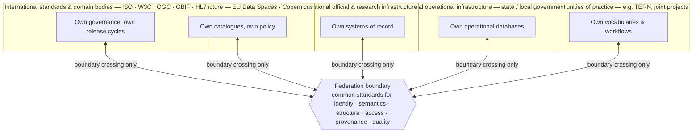
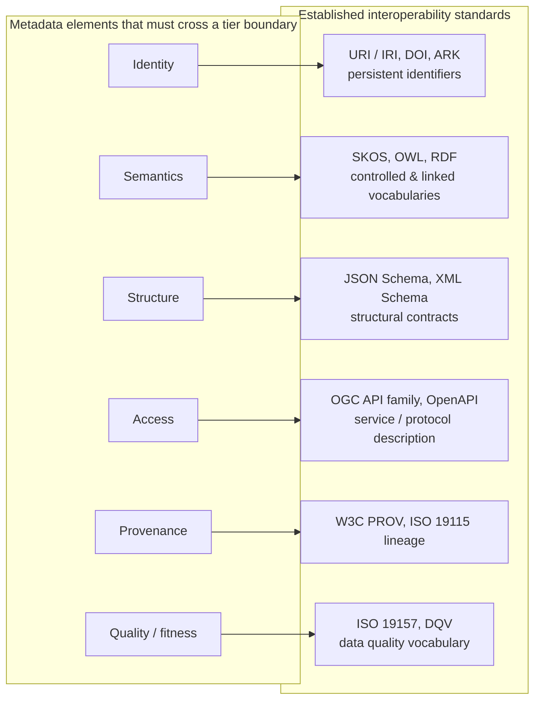
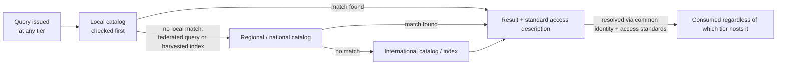
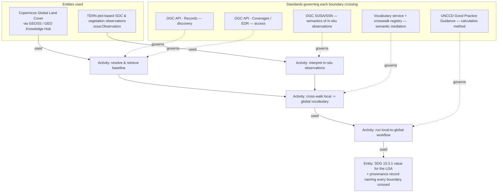
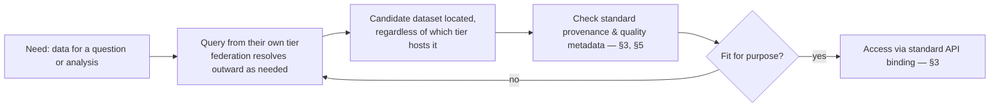
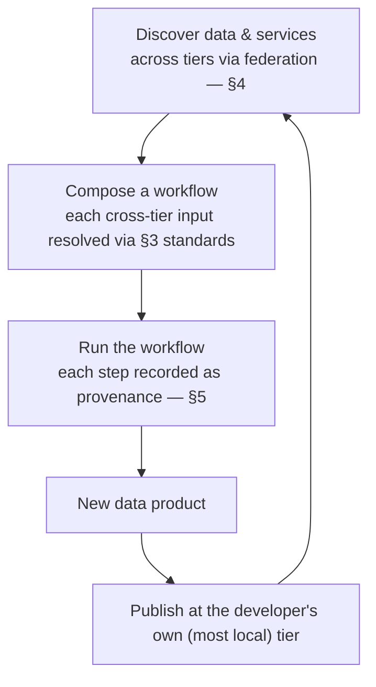
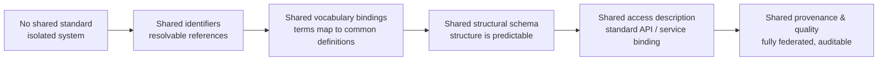

**This document is not fit for purpose - it is an experiment getting an LLM to synthesise the various viewpoints described in the documents in this directory.  do not cite, but feel free to offer a better version!**

# Federated Interoperability Across Governance Tiers

A summary model synthesising [[architecture]], [[metadata-tiers]] and [[agent-federation]], focused on two architectural questions: **what does federation actually require structurally when no tier can be forced to adopt another's systems**, and **which specific metadata elements need a common standard at the boundary between tiers, and why**.

This is deliberately scoped away from any particular toolchain. [[bblocks-versioning]] and the OGC Building Blocks framework describe *one* implementation pattern for the requirements set out here; they are not the requirements themselves, and this document does not assume them. What follows is the architecture a federation has to satisfy regardless of which tooling any given tier happens to use to satisfy it.

---

## 1. Federation is the architectural answer, not a compromise

[[metadata-tiers]] observes that "no universally accepted, and perhaps no valid, solution for federated management of metadata using different technologies and profiles has been identified" across the communities it surveys (CODATA/CDIF, OGC, ISO TC211, W3C, GEO, RDA, national SDIs, and others). [[architecture]] separately catalogues what happens without one: no accepted model of feature types, no systematic provenance for outputs, ad-hoc data quality, heterogeneous documentation.

Two architectures are ruled out by the actors involved, not by preference:

- **Centralisation** — a single authority defining the data model, vocabulary and access mechanism for every tier — is structurally impossible here. [[metadata-tiers]]'s governance-domain list runs from ISO/W3C/OGC down through regional infrastructure, national agencies, local operators, and communities of practice like TERN. No one of these has, or should have, authority over how the others run their internal systems ([[architecture]] §Technology: "no general system evolution pathway that can or should be forced on them").
- **No coordination** — every tier free to define its own metadata with no shared reference points — reproduces the fragmentation [[metadata-tiers]] documents as the current, unresolved state of the field, and blocks the auditability [[agent-federation]] identifies as the precondition for any agent (human or AI) to safely combine data across tiers.

**Federation** is the architecture that sits between these: tiers remain independently governed and internally autonomous, and interoperate only by agreeing on a small set of standards for the metadata elements that have to cross a tier boundary. Everything on the inside of a tier — its database technology, its internal schemas, its release process — is out of scope for federation entirely.

---

## 2. Governance tiers are federation boundaries, not layers

[[metadata-tiers]] §Enterprise viewpoint separates actors along two independent axes: **governance domain** (international standards → international domain standards and data providers → regional infrastructure → national infrastructure → local operational infrastructure → communities of practice → project context) and **behaviour** (data producer, product generator, integration pathway designer/deployer, access service provider, archival role, and so on — the same behaviour can occur at any tier).

The architectural consequence of treating these as independent axes is that a "tier" is not a layer in a stack that data passes through — it is a **boundary** at which autonomy meets federation. Nothing requires data to move up through every tier to become interoperable; a local dataset can federate directly with an international consumer if the boundary standards are met, exactly as it can stay purely local if they are not.

Each tier's internal box is opaque to every other tier by design — federation does not require, and should not assume, visibility into how any tier runs internally. Standardisation effort is spent entirely on the boundary.

---

## 3. The metadata elements that must be commonly standardised

This is the central architectural question: **of everything a tier could describe about its data, what specifically has to be expressed in a common standard for federation to work at all** — as opposed to being left to local convention?

Reading [[architecture]] §Information ("unambiguous identification of information elements... linked to richer semantic descriptions... links to knowledge graphs... clear dependencies") against [[metadata-tiers]] §Information Viewpoint (controlled vocabularies, schemas, data models, access-mechanism descriptions, relationship definitions) yields six recurring categories. Each fails federation in a distinct, observable way if left unstandardised:

| Element | Question it answers | What breaks without a common standard | Established standards |
|---|---|---|---|
| **Identity** | Which thing, exactly, is this? | Two tiers cannot know they are referring to the same entity | URI/IRI, DOI, ARK — resolvable, persistent identifiers |
| **Semantics** | What does this term/value mean? | A shared term silently means different things at each tier | SKOS, OWL, RDF — controlled and linked vocabularies |
| **Structure** | What shape is the payload? | Consumers cannot parse data they haven't seen before | JSON Schema, XML Schema — technology-specific but format-neutral in intent |
| **Access** | How is this reached or queried? | Every tier needs a bespoke integration for every other tier | OGC API family, OpenAPI — service/protocol description |
| **Provenance** | What produced this, from what inputs, under what process? | Downstream users cannot audit or trust a cross-tier result | W3C PROV, ISO 19115 lineage elements |
| **Quality / fitness** | Is this good enough for a given use? | "Interoperable" is confused with "usable" — data moves but trust doesn't | ISO 19157, DQV (Data Quality Vocabulary) |

Everything else — internal storage format, processing pipeline, naming convention for non-shared fields, choice of programming language or database — is legitimately local and federation has no opinion on it. This distinction (boundary-critical vs. locally free) is the architectural core of "autonomy with interoperability": it names exactly what autonomy does *not* extend to, and nothing more.

---

## 4. Federation as a discovery and resolution pattern

[[metadata-tiers]] §Computational maps the problem onto FAIR, and makes a specific architectural point about **Findable**: users and agents should be able to "go where they already are" rather than being routed through a designated global entry point. Architecturally, this means federation cannot depend on a single mandatory index — it has to support **query propagation outward, only as far as needed**.

The architectural requirement this exposes: **identity and access standards (§3) have to be resolvable independently of where a query originates.** A local user's query and an international agent's query must be able to land on the same dataset through the same identifier and the same access description — federation breaks the moment identity or access binding becomes tier-specific.

[[agent-federation]] §Computational adds the corollary for AI-mediated use: "semantically explicit API and data description metadata is not widely available" today, and without it agents either hallucinate structure or exhaust their context budget rediscovering it per query. Standardising §3's elements at the boundary is what makes that discovery cheap enough to repeat at agent-driven scale rather than once per human integration project.

---

## 5. Provenance across federation boundaries

A federated result — one that combines data crossing several boundaries — needs to carry forward *which standard governed each crossing*, not just which data was touched. [[agent-federation]] and [[metadata-tiers]] both use the same worked example: computing SDG 15.3.1 (Land Degradation Neutrality) for an Australian LGA by combining a global baseline with jurisdiction-specific in-situ data.

Each activity is auditable specifically because it names the *standard*, not only the data — this is what turns a federation boundary crossing from an implicit assumption into a checkable claim.

---

## 6. Engineering concerns: where federation can fail

[[metadata-tiers]] §Engineering names the structural risk directly: the more generalised (higher) tiers "could potentially be over-burdened, and act as a single point of failure" — through transaction limits, economic sustainability, governance discontinuity, or malicious denial — and systems that depend on them at run time inherit that fragility. [[architecture]] §Engineering makes the same point from the other direction: a standards body "should be [a] point of truth, not a run-time dependency."

The architectural implication is that **federation boundaries must be resolvable offline or cached**, not queried live on every transaction:

- Boundary metadata (§3) should be **retrievable and cacheable independently** of the tier that authored it, so a local tier can keep operating against a stale-but-valid copy if a higher tier is unreachable.
- **No tier should be a mandatory run-time dependency** for another tier's core operation — federation informs how systems are built and validated, not how every transaction is served.
- Trust and security boundaries exist at *every* crossing in §2's diagram, not only at the outermost one — a compromised or malicious mid-tier actor is a risk the architecture has to contain locally, not assume away.

---

## 7. Technology neutrality: the standards, not the stack

[[metadata-tiers]] §Technology is explicit that "any general approach needs to be technology neutral, since every stakeholder... will have its existing capabilities and there will be no general system evolution pathway that can or should be forced on them." Each tier will also be "optimised for the particular application domain," simplifying where consensus is unnecessary and standardising only where it adds value.

This means the six standards in §3's table are chosen because they are **encoding-agnostic at the level that matters**: a persistent identifier resolves the same way whether the record behind it is JSON, XML or a relational row; RDF/SKOS vocabulary bindings can be projected into JSON-LD, XML, or a plain lookup table without changing what the term means; PROV-O provenance statements are a graph, not a file format. A tier adopts the *standard*, not a specific vendor's implementation of it — [[bblocks-versioning]] and the wider OGC Building Blocks framework are one such implementation (packaging JSON Schema + JSON-LD + SHACL together), useful to know about but not assumed or required by anything in this document.

---

## 8. Three persona views under federation

### 8.1 Traditional data provider — seeking reusability of data products

The provider's system of record stays exactly where it is, at whatever tier they belong to. Their architectural obligation is narrow: describe the data using §3's six standards at their own boundary, and let federation carry discoverability outward.

The provider never has to publish "upward" to a central authority — federation (§4) is what makes a locally-registered dataset reachable from any other tier, provided the boundary standards are met.

### 8.2 Data user — seeking data, needing transparency of suitability

The user's problem is not which tier to search — federation means they search from wherever they already are (§4) — it is deciding whether what they find is trustworthy enough to use, which depends entirely on whether §3's provenance and quality elements are actually present.

Transparency here is architectural, not procedural: it exists only because provenance and quality were required boundary elements (§3), not optional documentation.

### 8.3 Analytical workflow developer — building data products for others

This actor composes inputs that may come from several different tiers in a single workflow. Every boundary they cross needs the same six standards a simple consumer needs — plus their own output has to re-cross a boundary in the other direction when they publish it.

Publishing "at the developer's own tier" rather than to some designated global registry is the same architectural point as §8.1: federation propagates outward from wherever something is registered, so the product does not need to be pushed anywhere beyond its point of origin to eventually become discoverable at any other tier.

---

## 9. Incremental federation maturity

Because §3's six standards are independently useful, a tier does not need to adopt all of them before federation delivers any value — each one addresses a distinct failure mode on its own.

A tier stuck at M1 (identifiers only) is still measurably better federated than one at M0 — records can at least be cited and correlated, even before they can be machine-parsed or trusted for reuse. This is what makes the model incremental rather than a compliance threshold: each rung is a real, independently achievable improvement.

---

## 10. Open questions

- A RACI matrix of behavioural roles (§2) against governance tiers would make explicit who is *accountable* for maintaining each of §3's six standards at each boundary — currently only implied by the actor lists in [[metadata-tiers]].
- §3's table treats each standard as independently sufficient; in practice vocabulary crosswalks (semantics) and structural schema mapping (structure) interact — a term can be correctly bound but attached to an incompatible structure. The crosswalk mechanics needed to resolve this are named in [[agent-federation]]'s worked example but not yet generalised here.
- §6's caching/offline-resolution requirement is stated as a constraint, not a pattern — [[architecture]] §Engineering flags the same gap ("proxying content to make it available in specific environments") without resolving it, and it remains the largest unaddressed engineering risk in this model.
