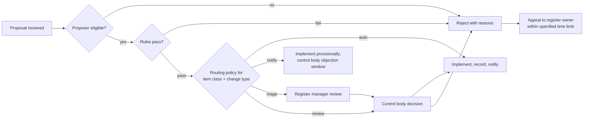

# Registers and register governance for federated semantic resources

**Based on ISO 19135:2026, *Geographic information — Registration and register governance***

**Audience:** a business analyst who will develop requirements for tools supporting the publication, extension and promotion of vocabularies, schemas and related semantic resources across a federation of research and operational infrastructures.

**Assumed prior knowledge:** none about registers. The briefing assumes you know what a vocabulary or schema is, and that you have seen them published on the web.

---

## 1. Why this document exists

Most people who publish a vocabulary think about *content* (are the terms right?) and *hosting* (where does it live?). Some think about the interoperability (how is it formatted and accessed?). Mature infrastructures are explicit about *governance*: who is allowed to change it, who decides, on what criteria, and what a downstream user is entitled to expect when it changes. Very few however have extended this to the issue of *federated systems*, where trust can be supported by effective and transparent reuse of resources from different providers with specific and complementary remits.

That omission is tolerable for a single vocabulary used by one project. It becomes the dominant cost once resources are reused across organisations, and it is the reason so much reuse is fragile: a downloaded copy silently diverges from its source, an extension forks rather than extends, an authoritative body cannot accept a good contribution because it has no process to receive it.

A project register, a community repository, a national infrastructure and an international standards body all legitimately apply different rules, different rigour and different turnaround times. The task is not to impose one governance model. It is to make each participant's governance *explicit, documented and machine-actionable* so that resources can move between them without loss of meaning or provenance.

> ISO 19135:2026 provides the vocabulary and the structure for describing the governance of a register,  and it deliberately stops short of implementation. Critically it is silent on the challenges of **interoperability of implementations across federated system boundaries**, and typical distribution of authority across tiers of governance and supporting infrastructure.  This is the space these requirements will occupy.

**Companion documents.** This briefing sits alongside two related analyses:

- *[Tiered Metadata Model for Data and Model Reuse](metadata-tiers.md)* — the system context, governance domains and RM-ODP viewpoints.
- *[Capability model for semantic resource publishing](capability-model.md)* — a progressive business maturity model providing for progressive establishment of re-use requirements (Documented → Internationally standardised) with per-tier metadata profiles.

Together these documents 

---

## 2. What ISO 19135:2026 provides

The 2026 edition is not a revision of the familiar 2005 register schema — it is a reframing. It introduces the **Framework for Extensible Registration of Information (FERIN)** and generalises the standard away from geospatial content to information management in any domain. Three features make it directly usable here.

**It separates three areas of concern.**

| Area | What it covers |
|---|---|
| **Data** | The information in the register and how it evolves — identifiers, versions, statuses, relations, the two information planes |
| **Governance** | Processes, roles and responsibilities, and the documented information that records them |
| **Compliance** | The *commitments* a register makes to its users, and conformance against them |

**It is explicitly technology-neutral and capability-based.** Requirements state what a register must be able to do, not how to build it. There is no prescribed encoding, no prescribed metadata scheme, and no XML schema. Requirements are modular, grouped into requirements classes, and a register conforms to the classes it needs.

**It is extensible by design.** Statuses and relations are extensible — a register may define new ones. This is what allows a lightweight research register and a national authority to be described by the same framework without pretending they are the same thing.

Three consequences worth stating plainly to a non-specialist audience:

1. Conformance is not all-or-nothing. There are five defined register types of increasing capability (§5). A project vocabulary can be genuinely conformant without any of the machinery an ISO registration authority needs.
2. Because implementation is out of scope, everything specified for the tooling — interfaces, validation engines, notification, synchronisation, review queues — is unconstrained by the standard. The standard constrains the model, the processes and the documentation. It does not choose the software.
3. The normative framework describes a **single register**. Federation is not specified. This is significant enough for our purposes to deserve its own statement.

### 2.1 What the framework does not specify: federation

The normative text of ISO 19135:2026 defines the requirements for what it calls a **simple register** — one register, one identifier scope, one set of governance processes. All five conformant register types are types of simple register. **There is no requirements class, and therefore no conformance class, for a composite, hierarchical or federated register.**

The concept has not disappeared: "composite register" is a defined term, and Annex E describes three topologies (§6). But Annex E is **informative**, and it says why: earlier editions presented these register types normatively, and the committee concluded that such constructs vary too widely and are too implementation-dependent to be specified. The hierarchical register conformance class that existed in the 2005 and 2015 editions is gone.

What the normative framework does provide is a set of *enabling primitives* on which a federation can be built:

- a **register identifier** as a first-class component, with the requirement that an object identifier be externally referenceable in combination with it — and a conformance test for exactly that. This is what makes an item in one register globally addressable from another;
- **functional identifiers**, which are redirectable and required to support hierarchical specification — the basis for partitioned namespaces and for references that survive change;
- **extensible relations and statuses**, so relationships that cross a register boundary can be defined locally;
- **register item class requirements that may be stated against external data**, which is what allows validation to take account of something held elsewhere;
- the **register specification**, which is explicitly the place to define requirements extended beyond the standard.

So the accurate position is: *federation is neither prohibited nor specified — it is enabled and left to be designed.* Two practical consequences follow, and both matter for the requirements work:

- **The federation rules are yours to write.** Mutual recognition, delegation of authority, synchronisation, conflict resolution, namespace coordination, quality assurance across nodes, and entry and exit — all of it must be specified locally, in the participating register specifications and in a federation agreement. Annex E lists these as considerations; it does not tell you how to meet them.
- **No product can claim conformance for its federation features.** Conformance claims stop at the individual register. When assessing platforms, "ISO 19135 conformant" says something meaningful about identifiers, versioning, statuses, processes and roles, and nothing at all about how well two registers work together. That part has to be evaluated on its merits.

---

## 3. Core vocabulary

Five distinctions do most of the work.

**Register vs register system vs register specification.**
The **register** is the managed collection of information and its governance. The **register system** is the information system it runs on (called a "registry" in earlier editions). The **register specification** is the document that states the register's purpose, scope, roles, processes, content requirements and identifier and versioning schemes. Keeping the first two apart is what makes custody transfer, mirroring and platform migration thinkable. The third is the single most important artefact in the whole model, and §7 returns to it.

A register differs from a dataset or a database precisely in that it is governed through defined processes.

**Concept plane vs content plane.**
This is the significant structural idea in the 2026 edition, and it repays a moment's attention.

- The **concept plane** holds meaning: concepts, concept versions, concept definitions, concept systems, and the relations among them.
- The **content plane** holds representation: register item classes and register items — the concrete data that realises a concept version.

Separating them lets a register evolve *what something means* independently of *how it is represented*, and lets the requirements on a kind of content change over time without invalidating what has already been published. For semantic resources this maps naturally: the concept is the term as a unit of meaning; the register item is its expression in a particular structure.

**Managed vs unmanaged content.**
Information held in the register that is under governance, versus information stored alongside it that is not. Useful operational metadata — harvest timestamps, cache state, usage counts — can sit next to register items without being subject to the proposal and approval process. Getting this boundary wrong in either direction is expensive: governed content that should be operational creates pointless review load; operational content that should be governed creates silent, unauditable change.

**Object identifier vs functional identifier.**
An **object identifier** is permanently bound to one object and never redirects. A **functional identifier** is redirectable: what it points to may change over time so that it continues to serve its original intent (for example, "the current version of this concept"). A register needs both, and needs to be explicit about which is which — this is the difference between citing a specific version and citing "whatever is current", and it is where most identifier confusion in vocabulary publishing originates.

**Item class as the unit rules attach to.**
A **register item class** is a defined abstraction of a set of register items sharing common characteristics, and it carries the data requirements for those items. **Validation rules attach to item classes.** That is the hook on which the whole rule-based tooling model hangs.

---

## 4. Roles, statuses and actions

### The six roles

A conformant register assigns all six. One party may hold several — that is explicitly allowed, and normal in a small organisation. The roles matter because they separate when the register federates.

| Role | Responsibility | Typical holder in a research tier |
|---|---|---|
| **Register owner** | Ultimate responsibility. Creates the register specification; appoints the other roles; sets proposer eligibility, access terms, process time limits and appeal procedure | Institution, infrastructure programme, national facility |
| **Register manager** | Content governance: receives proposals, verifies eligibility, forwards to the control body, implements approved changes, informs proposers | Platform operator / vocabulary service team |
| **Control body** | Subject matter experts who decide whether content changes are approved | Domain working group, editorial board, named domain editor |
| **Proposer** *(also: register change proposer, submitting organization)* | Proposes changes; clarifies on request; may withdraw at any time during approval | Research group, project, or another register |
| **Register system manager** *(previously: registry manager)* | Manages the information system | IT operations |
| **Register user** | Accesses content, potentially at differentiated access levels | Researchers, agencies, downstream systems, software agents |

Two observations that reliably surprise newcomers:

- **The register manager does not decide content.** Its role is procedural — eligibility, completeness, routing, implementation, notification, record-keeping. This is exactly why much of it can be automated, and why "automating the register manager" is a coherent goal whereas "automating the control body" is a policy decision to be made deliberately, per item class.
- **The control body's most valuable output is criteria, not verdicts.** §7 develops this, and the standard supports it directly: the rules must be written down.

### Statuses and actions

Statuses apply to **concept versions**, and — a change from earlier editions worth flagging — they are no longer a single list of mutually exclusive values. They are separated into independent concerns:

| Status concern | Values | Obligation |
|---|---|---|
| **Validity** | valid / invalid | Required |
| **Publication** | published / unpublished | Required |
| **Redaction** | redacted | Optional; the register owner decides and documents the choice |
| **Deletion** | deleted | Optional; likewise |

Supersession is expressed as a **relation**, not a status. A register may define further statuses of its own in its register specification — *draft*, for instance, is a common addition.

The required core is therefore very small: validity and publication. Everything else is a documented local choice, which is precisely the flexibility a tiered ecosystem needs. It also allows combinations that earlier editions could not express, such as superseded *and* invalid, or superseded *and* no longer recommended. What was called "retired" in the previous edition is now the combination of valid and unpublished.

Actions are the defined ways content changes: *addition*, *publish*, *unpublish*, *invalidation*, *supersession*, *redaction*, *deletion*.

Note that the 2026 edition distinguishes **publication** from **validity**. A concept version can be valid but not visible, or visible but no longer recommended. For federated publishing this is more useful than it first appears: it gives a clean way to stage content, to embargo, and to withdraw from view without destroying the record.

Changes are classified as:

- **substantive** — major impact on use; typically alters semantics or technical meaning;
- **clarifying (non-substantive)** — minor impact, such as editorial correction that causes no compatibility issue;
- **correctional** — available in the most capable register type, for correcting the record itself.

Deciding which of these a proposed change is remains a semantic judgement, and it is the most consequential decision for downstream users: a clarification is invisible to them, a supersession obliges them to act. Critically, **the standard requires the register owner to define what counts as a substantive change for that register, and to document it in the register specification.** The boundary is set per register, in writing, in advance — not argued case by case.

There are also destructive actions — redaction and deletion — which exist because real registers occasionally must remove content for legal or privacy reasons. Any tool has to support them without compromising the traceability commitments that make the register trustworthy in the first place.

---

## 5. Five register types: a conformance ladder

The standard defines five conformant register types, built from three requirements classes (content, concept, governance) plus advanced semantics.

| Type | Adds | What it means in practice |
|---|---|---|
| **Content register** | Content register requirements | Identifiers, versioning, item classes, items, actions, a register specification and proposal instructions. No concept plane, no governance requirements class |
| **Concept register** | Concept register requirements | Adds concepts, concept versions, statuses and relations — meaning is modelled separately from representation |
| **Governed content register** | Content + governance | Adds the six roles and the full process set. Broadly equivalent in coverage to a register conforming to the previous edition |
| **Governed concept register** | Concept + governance | Both planes, fully governed |
| **Comprehensive concept register** | Concept + governance + advanced semantics | Adds inheritance, partitive/composed concepts, concept domains, concept incorporation, definition migration and correctional change |

This ladder is a gift for the tiered ecosystem. It gives a defensible, standards-based answer to "what does *minimum viable governance* look like?" — and it is orthogonal to the business maturity of the resource. A tier-4 community vocabulary can be a governed concept register; a tier-8 operational resource that is a flat code list may only need a governed content register.

An indicative alignment with the capability model — to be confirmed per resource class, not applied mechanically:

| Capability model tier | Plausible minimum register type |
|---|---|
| 1–2 Documented, Transparent | Below register scope: publication, not registration |
| 3 Reproducible | Content register |
| 4–5 Community-shared, Domain-contributed | Concept register, or governed content register where a review process already exists |
| 6–7 Domain-standardised, Cross-domain standard | Governed concept register |
| 8–9 Operationally adopted, Internationally standardised | Governed concept register with strong commitments; comprehensive concept register where the content model demands inheritance, composition or incorporation |

The value of stating this is that a promotion between business tiers becomes a concrete, checkable change in register type and commitments, rather than an aspiration.

---

## 6. Composite registers: patterns, not provisions

**Everything in this section is drawn from Annex E, which is informative.** These are recognised patterns with worked examples, not requirements, and there is nothing to conform to. Treat them as a shared vocabulary for design discussions and as a checklist of what a federation design has to answer — not as a specification you can adopt.

A register managed as a single entity with one identifier scope and one set of governance processes is a **simple register**. A **composite register** is internally composed of two or more simple registers that act in effect as one; each internal register may have its own namespace and its own governance. The arrangement is called a **topology**. Where a composite register is built, each internal register is expected to conform in its own right — conformance is assessed node by node, never for the composite as a whole.

Composite arrangements exist to support exactly the concerns the tiered-metadata analysis raises: segregating managerial duty, improving availability, respecting data sovereignty, and scoping jurisdictional and regulatory concerns.

| Topology | Structure | Where it fits |
|---|---|---|
| **Hierarchical** | Sub-registers beneath higher-level registers; namespace may be partitioned; change control delegated across levels | A national or domain register with institutional or project sub-registers |
| **Federated** | Independently governed member registers that mutually recognise one another, under a federation agreement | Peer infrastructures — a research data commons and a domain network, neither subordinate |
| **Hub and spoke** | A special case of hierarchical: one hub holds the authoritative data, and every spoke item refers back to it | Localisation, translation and national specialisation of an agreed core |

One point of guidance is worth adopting even though it is not binding: a central "register of registers" should be a real register rather than a list, retaining the traceability of changes that makes any register trustworthy. A federation index is a governed object with an owner and a control body, and should be built as one.

Annex E also sets out what each topology obliges you to work out for yourself, and this list is the most immediately useful thing in it — it is, in effect, the agenda for the federation design work:

| Consideration | The question it forces |
|---|---|
| Delegation of authority | What authority is delegated to whom, with what scope and what constraints? |
| Synchronisation | How is consistency maintained when a higher-level or hub register changes? |
| Identifier coordination | Partitioned namespaces or a coordination protocol — and who arbitrates? |
| Conflict resolution | What happens when two nodes hold incompatible information? |
| Quality assurance | What validation happens at which node? |
| Discovery | How is metadata shared so that cross-register search works? |
| Entry and exit | How does a member join or leave, and what happens to references and data? |

None of this is specified. All of it has to be written into the participating register specifications and, for a federation of peers, into a federation agreement. That is the honest scope of the work — and it is also where a local profile adds genuine value, because it is the part no standard currently supplies.

### Research federation situations, expressed in these terms

The situations below are ours, not the standard's. The middle column shows how each is *described* using the framework's vocabulary and primitives; none of them is a conformance target.

| Situation | Expressed using the framework | Principal consequence for tooling |
|---|---|---|
| **Project register** | Simple register; content or concept register type; owner, control body and proposer may all be the same small group | Minimum viable governance, heavily automated, one accountable human |
| **Extension** — a researcher extends an authority's vocabulary | Sub-register in a hierarchical topology, or a spoke in hub-and-spoke, with its own control body; the authority's register is unmodified | Dependency declaration on an upstream register state; namespace separation; validation against upstream requirements as well as local ones; detection of upstream changes that invalidate local items |
| **Promotion** — the extension is offered upstream | The downstream register acts as **proposer** to the upstream register | Registers must be able to *act* as parties, not just store data; bulk proposal generation with justification; mapping of local to newly minted upstream identifiers; downstream must survive rejection |
| **Adoption / caching** — content is taken or mirrored from elsewhere | Cross-register references; in hub-and-spoke, mandatory reference back to authoritative hub data | Actionable pointer to origin, not an attribution string; observable freshness state; defined divergence-resolution authority; full service from cache when upstream is unreachable |
| **Crosswalk** — mappings between two vocabularies | Register items in their own item class, in a register owned by neither endpoint; relations are extensible, so mapping relations can be defined | Validation must check both endpoints remain valid; crosswalk registers are the heaviest consumers of upstream change notification |
| **Federation index** | A register of registers — governed, traceable, not a list | Member registration and exit; endpoint health; capability and commitment declaration per member |

The message to communicate to an audience meeting this for the first time: **an extension is not a second-class fork.** It is a legitimate, published, citable register, governed by someone else, with a declared relationship to what it extends.

---

## 7. Control bodies set rules, not just decisions

This is the conceptual pivot for the tooling, and the standard supports it rather than merely permitting it.

Among the register owner's responsibilities are: defining rules and guidelines on addition and modification; defining what constitutes a substantive change; specifying proposer eligibility criteria; specifying time limits for approval and appeal; and defining the proposal process. Among the register specification's requirements are that all of these be documented, along with content requirements, basic data elements, the identifier scheme, the versioning scheme and version assignment criteria — and that any requirements extended beyond the standard be defined there too.

In other words: **the framework already requires that the rules be written down.** The tooling opportunity is to make them executable.

> A control body's job is to define, publish and maintain the criteria under which content will be accepted, for each item class it governs. Deciding individual cases is what it does when the criteria do not settle the matter.

Three kinds of rule will be needed:

| Rule kind | Checks | Example | Executed by |
|---|---|---|---|
| **Structural** | Shape and syntax of submitted content | Every concept has exactly one preferred label per language | Schema validator |
| **Semantic** | Relationships and graph constraints | No concept is its own broader term; every narrower term's broader term is in-register or a declared upstream dependency | Graph constraint engine |
| **Governance / contextual** | Facts about the proposer and the context rather than the content | Proposer meets the eligibility criteria; licence is on the approved list; identifier matches the register's scheme; a definition source is cited | Policy evaluation against register state |

Governance rules are the ones most often missed, and they are the ones that encode tier differences. The capability model's per-tier metadata profiles convert directly into rule sets — including its **null profile** idea, where a tier adds no new content elements but constrains who may publish, or how values must be drawn.

Four design principles worth carrying forward:

1. **Rules are versioned artefacts with their own governance.** Items were accepted under a particular version of a rule set; conformance claims must cite it. The framework's own logic suggests the answer: a register of register specifications and profiles. Self-referential, but tractable and honest.
2. **The same artefact runs on both sides.** A proposer must be able to run exactly the checks the register will apply, before submitting. This matters more than usual here, because the standard treats a proposal returned for modification as a rejection requiring a fresh proposal — there is no in-place repair of a submitted proposal. Pre-flight validation is therefore not a convenience, it is what keeps the process from thrashing.
3. **Rules must compose and layer.** A tier-6 profile is a tier-4 profile plus constraints; a sub-register's rules must compose with those of the register it extends.
4. **Be explicit about what is *not* checked.** "Is this definition actually correct?" is not machine-checkable. Naming the residue makes the human workload visible and intentional rather than accidental.

**Candidate technology, offered without commitment.** OGC Blocks (bblocks) packages a JSON Schema, a JSON-LD context, SHACL shapes, examples and test cases as a single versioned, published component; supports profiles that specialise other blocks with stricter constraints; and publishes collections with a register index. That maps closely onto layered, versioned, executable rule sets, and is already used in this community. The framework's technology neutrality still applies: the model must not assume it.

---

## 8. The acceptance spectrum

Explicit rules let register managers automate the routine and escalate the exceptional. There is no single correct level of automation — it varies by register, item class and change type — so the level should be *configuration set by the control body*, not hard-coded behaviour.

| Level | Behaviour | Appropriate when |
|---|---|---|
| **Auto-accept** | Rules pass, change is implemented immediately | Low blast radius, tightly constrained item class, trusted proposer — adding a term to a project register |
| **Accept with notice** | Implemented provisionally; the control body has a defined window to object | Established registers with an engaged control body and high volume |
| **Manager triage** | Register manager assesses materiality and decides whether to escalate | Mixed-quality submissions; the sensible default for a new register |
| **Control body review** | Always human | Substantive changes, supersessions, anything with known dependents |
| **Appeal** | Register owner | Disputes and precedent-setting decisions |

Factors that should drive routing, and therefore need to exist as data:

- **change type** — additions are usually cheaper than supersessions; retirements and destructive actions are always material;
- **item class** — a mapping item and a concept item carry different risk;
- **proposer standing** — an accredited upstream register versus an unaffiliated individual;
- **rule outcome** — clean pass, pass with warnings, or fail;
- **blast radius** — how many known dependents reference the item. This is the factor most likely to be missing from an existing platform, and the one most worth building for.

Two non-negotiables regardless of level. First, **every decision produces a retained record** — who or what decided, under which rule set version, when, and on what justification; the standard requires proposal submission and decision information to be retained, and an automated acceptance is a decision by the control body's published rules, exercised by the manager's tooling. Second, **every material change generates a notification** to dependents. Automation without notification simply moves the fragility downstream.

---

## 9. Commitments: the promise layer

The third area of the framework is the one with no equivalent in earlier editions, and it is the one that will matter most to institutional adopters. A register makes **commitments** to its users, documents them in the register specification, and can be assessed against them. They fall into three groups:

- **Access** — to metadata, to current content, and to historic content;
- **Persistence, integrity and traceability** — identifier persistence; metadata persistence and retention; content persistence and retention; historic persistence with full traceability;
- **Transparency** — of metadata, of content, and of history.

Two things follow. First, this is the vocabulary in which a research infrastructure can make a *credible, differentiated* promise: a project register may commit to metadata persistence but not content persistence; a national facility commits to both plus full historic traceability. Downstream users can then make informed decisions about what to depend on. Second, commitments are the natural basis for evaluating any candidate platform: a product either can evidence these properties or it cannot.

---

## 10. Where the requirements will come from

Deliberately not enumerated here. The point to note is that the framework supplies most of the structure for the requirements set, so the analysis effort goes into the parts it leaves open rather than into inventing a skeleton:

- the standard's **requirements classes** define the capability and governance obligations for whichever register types are in scope, and its conformance test suite indicates how each is to be demonstrated;
- the **register specification** — for which the standard provides a template and a worked sample — is the artefact that captures everything decided locally: scope, roles, processes, content requirements, identifier and versioning schemes, eligibility criteria, substantive-change definition, and commitments;
- the **composite topology considerations** (delegation, synchronisation, conflict resolution, quality assurance, discovery, entry and exit) set the agenda for anything beyond a simple register — but supply no requirements, so this part must be specified from scratch and cannot be discharged by citing conformance;
- the genuinely novel work sits in what the standard leaves to implementation: executable rule sets, pre-flight validation, decision routing and automation, dependency and blast-radius tracking, notification and subscription, and cross-register synchronisation.

---

## 11. Terminology crosswalk

| ISO 19135:2026 | What people usually say | Note |
|---|---|---|
| Register | Vocabulary, code list, catalogue, dictionary | A managed collection, governed by defined processes |
| Register system | The platform, the vocabulary service | Called "registry" in earlier editions |
| Register specification | Governance policy, terms of reference | Loosely called the "technical standard" in earlier editions |
| Concept | Term, meaning | Concept plane |
| Concept version | Version of a term | Realised as a register item |
| Register item | The record, the entry | Content plane |
| Register item class | Type of thing, resource type | The unit rules attach to |
| Proposer | Contributor, project, upstream partner | Also "submitting organization" in earlier editions |
| Register owner | The institution, the programme | Ultimate responsibility; writes the specification |
| Register manager | The vocabulary service team | Content governance; no content authority |
| Control body | Editorial board, working group, "the editor" | Approval — and, in practice, rule author |
| Register system manager | IT operations | Called "registry manager" in earlier editions |
| Substantive change | Breaking change | Defined per register, in the specification |
| Clarifying change | Typo fix, editorial | Non-substantive |
| Superseded / retired | Replaced / deprecated | Statuses; record retained |
| Object identifier | Permalink to a specific version | Never redirects |
| Functional identifier | "Latest version" link | Redirectable, retains original intent |
| Simple register | A single vocabulary service | The only kind of register the normative text specifies |
| Composite register | Federation | Informative only: hierarchical, federated, or hub-and-spoke topology |

---

## 12. Open questions

1. **Which register types are in scope, for which resource classes?** This is the highest-leverage early decision: it determines the requirements classes that apply and the size of the build.
2. **How many item classes at launch?** Concepts and concept systems are certain. Schemas, rule sets or profiles, crosswalks and dataset descriptions are candidates. Each added class multiplies the rule-authoring burden.
3. **Are rule sets and register specifications themselves registered?** Coherent, and gives versioning and governance for free, but adds conceptual load for a first-time audience. Structural, so decide early.
4. **What is minimum viable governance for a project register?** If a project must constitute a control body, no one will use it. A defaulted control body of one named individual with an escalation path is the likely answer.
5. **Where is the managed / unmanaged content boundary?** Cheap to get wrong in both directions.
6. **How is blast radius known?** Dependency tracking works only if dependents declare themselves. Voluntary, incentivised, or a condition of consuming the register?
7. **Which topology, and who owns the index?** Hierarchical, federated and hub-and-spoke imply materially different agreements and different tooling. A federation index is itself a governed register — whose?
8. **How far do we go in specifying the federation ourselves?** Since the standard stops at the single register, the choice is between a minimal bilateral arrangement between two registers and a reusable federation profile that others could adopt. The second is more work and considerably more valuable, and would be a candidate contribution back to the community.
9. **What commitments will each tier make?** These are the promises that make the difference between a resource being reusable and being merely available.

---

## Sources

- ISO 19135:2026, *Geographic information — Registration and register governance* (published 2026-02-05; second edition, cancelling and replacing ISO 19135-1:2015 and its Amendment 1:2021). Introduces FERIN; source of the framework areas, register types, roles, planes, identifier types, statuses, actions, governance processes, register specification requirements, commitments, and — in the informative Annex E — the composite register topologies. Note that the normative framework specifies the single ("simple") register only; there is no conformance class for composite, hierarchical or federated registers.
- *Tiered Metadata Model for Data and Model Reuse* (companion) — governance domains, caching and engineering risk, technology neutrality.
- *Capability model for semantic resource publishing* (companion) — nine-tier maturity model and per-tier metadata profiles.
- OGC Blocks (bblocks) — candidate mechanism for executable, versioned, layerable rule sets (§7).
